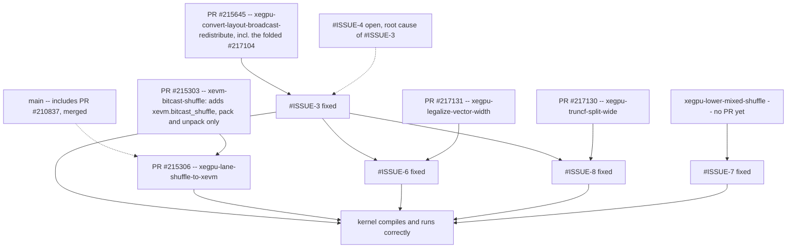

# [mlir][xegpu] Tracking: `simple_mxfp_gemm_quantizeA_F4.mlir` does not lower through `gpu-lower-to-xevm-pipeline`

**Labels:** `mlir`, `mlir:gpu`, `tracking`

**Status:** resolved -- the kernel compiles and produces numerically correct results.
**Sub-issues:** #ISSUE-2, #ISSUE-3, #ISSUE-4, #ISSUE-5, #ISSUE-6, #ISSUE-7, #ISSUE-8

## Summary

`mlir/test/Integration/Dialect/XeGPU/WG/simple_mxfp_gemm_quantizeA_F4.mlir` (currently marked
`XFAIL: *`) does not lower. This is a tracking issue that records the measured state of the
lowering, so the individual problems can be worked on independently.

Short version: the kernel contains **five distinct kinds of `xegpu.convert_layout`**. Three of
them lower today (two by folding, one via in-flight work), one is handled by an open PR, and
**exactly one has no lowering**. Because the subgroup-to-lane pass rolls the whole module back
on failure and swallows the error, that single unsupported op currently makes it look as though
nothing was distributed at all.

## Reproduction

```
mlir-opt --gpu-lower-to-xevm-pipeline="xegpu-op-level=workgroup zebin-chip=cri" \
  mlir/test/Integration/Dialect/XeGPU/WG/simple_mxfp_gemm_quantizeA_F4.mlir
```

On `main` (`b3ccb7160d34`) this exits 1 with two diagnostics:

```
error: failed to legalize operation 'xegpu.convert_layout' that was explicitly marked illegal:
  <{input_layout  = #xegpu.layout<lane_layout = [1, 16], lane_data = [1, 1]>,
    target_layout = #xegpu.layout<lane_layout = [1, 16], lane_data = [1, 4]>}> : vector<8x64xbf16>

error: failed to legalize operation 'vector.multi_reduction' that was explicitly marked illegal:
  (vector<1x1x16xbf16>, vector<1x1xbf16>) -> vector<1x1xbf16>
```

Note the earlier assertion failure in `setupInsertStridedSliceResultLayout` no longer
reproduces; the pipeline now fails gracefully.

## Reading the diagnostics

Both messages are misleading and should be interpreted with care:

* `xegpu-sg-to-lane-distribute` reports **only the first** illegal op, then aborts the
  conversion. There are four more unsupported ops behind it.
* The pass then **discards the failure** (see #ISSUE-2), so the rolled-back, still
  subgroup-level IR flows on. The `vector.multi_reduction` error is pure fallout: it comes from
  `xegpu-vector-linearize` choking on a rank-3 vector that should no longer have existed. That
  reduction lowers correctly in isolation (butterfly `gpu.shuffle xor` + `arith.maximumf`).

## Inventory of `convert_layout` in the kernel

Taken from the IR immediately before `xegpu-sg-to-lane-distribute` (1136 ops total):

| count | input_layout → target_layout | shape | status |
|---|---|---|---|
| 1024 | `layout<[1,16],[1,1]>` → `slice<layout<[1,1,16],[1,1,1]>,dims=[1]>` | `vector<8x16xbf16>` | no-op, folds via `isCompatibleWith`; **should never have been created** (#ISSUE-5) |
| 16 | `layout<[1,16],[4,1]>` → `layout<[1,16],[4,1],order=[1,0]>` | `vector<32x16xi8>` | no-op, folds; same as above |
| 32 | `slice<layout<[8,1,2],[4,1,1],order=[0,2,1]>,dims=[0]>` → `layout<[8,1],[1,1]>` | `vector<8x2xf8E8M0FNU>` | lowers with [PR #215645](https://github.com/llvm/llvm-project/pull/215645) |
| 32 | `slice<layout<[1,1,16],[1,1,1]>,dims=[2]>` → `slice<layout<[8,1,2],[4,1,1],order=[0,2,1]>,dims=[0]>` | `vector<8x2xbf16>` | **no lowering** (#ISSUE-3) |
| 32 | `layout<[1,16],[1,1]>` → `layout<[1,16],[1,4]>` | `vector<8x64xbf16>` | lowers in `main` via [PR #210837](https://github.com/llvm/llvm-project/pull/210837), merged (`xegpu.lane_shuffle`) |

## Status of the XeGPU layer

PR #210837 is merged, so `main` already clears the fifth row of the table above. A branch adding
PR #215645 and the `xegpu.lane_shuffle` → XeVM lowering (PRs #215306 and #215303) clears the first
three rows as well; `mlir/test/Dialect/XeGPU`,
`mlir/test/Conversion/XeGPUToXeVM` and `mlir/test/Conversion/XeVMToLLVM` pass (47/47) on it. The
fourth row, #ISSUE-3, is the remaining XeGPU-layer blocker and is now fixed by
[PR #215645](https://github.com/llvm/llvm-project/pull/215645), on branch
`xegpu-convert-layout-broadcast-redistribute`.

Behind it sit two further problems outside the XeGPU layer, invisible until #ISSUE-3 was fixed:
#ISSUE-6 and #ISSUE-7. See "Current status".

The `xegpu.lane_shuffle` → `xevm.bitcast_shuffle` → `llvm.call @llvm.genx.GenISA.SubgroupBitcastShuffle`
chain was verified for the exact type this kernel produces (`vector<4xbf16> pack`).

## Sub-issues

* #ISSUE-2 — `XeGPUSgToLaneDistribute` silently ignores conversion failure (why the symptoms are misleading)
* #ISSUE-3 — no lowering for `convert_layout` from a replicated layout to a partially replicated target *(the blocker)*
* #ISSUE-4 — `multi_reduction` lane-layout rule places lanes on the reduced dim when the consumer layout happens to be a `SliceAttr` *(why the conversion exists at all)*
* #ISSUE-5 — layout conflict resolution uses `isEqualTo` and materializes 1040 no-op `convert_layout` ops
* #ISSUE-6 — no vector width legalization before the XeVM conversions; 32-component `arith` ops reach the backend *(second blocker, found after #ISSUE-3 was fixed)*
* #ISSUE-7 — mixed-size `vector.shuffle` is scalarized into ~48k `insertelement`/`extractelement`, 70% of the emitted LLVM IR
* #ISSUE-8 — `arith.truncf` wider than one `xevm.truncf` conversion group is not lowered *(the other blocker behind #ISSUE-3)*

#ISSUE-3 unblocks the XeGPU layer. #ISSUE-4 is the root cause and would remove the conversion (and
the surrounding broadcast/transpose chain) entirely; the two are complementary, not exclusive.
#ISSUE-6 is what actually stood between a clean MLIR pipeline and a compiling kernel. #ISSUE-7 is
not a blocker but dominates code size.

## Current status

**The kernel compiles end to end.** With #ISSUE-3, #ISSUE-6 and #ISSUE-7 fixed, `mlir-opt` exits 0
with empty stderr and emits a `gpu.binary @kernel` ELF object.

The path there, in order, since each problem was only visible once the previous one was fixed:

| # | symptom | resolution |
|---|---|---|
| #ISSUE-3 | `convert_layout` not lowered at sg-to-lane | fixed (PR #215645, `xegpu-convert-layout-broadcast-redistribute`) |
| #ISSUE-8 | `arith.truncf : vector<32xbf16> to vector<32xf4E2M1FN>` unconverted | fixed (PR #217130, `xegpu-truncf-split-wide`) |
| #ISSUE-6 | `LLVM ERROR: unable to legalize G_FPEXT <32 x s16> -> <32 x s32>` | fixed (PR #217131, `xegpu-legalize-vector-width`) |
| #ISSUE-6 | `LLVM ERROR: incompatible result and operand types in a bitcast` (sub-byte `i4` movement introduced by the first attempt at the above) | fixed (sub-byte exemption) |
| #ISSUE-7 | ~48k scalarized shuffle ops | fixed (`xegpu-lower-mixed-shuffle`) |

Emitted LLVM IR went from 68613 to 25380 lines. No 32-component arithmetic remains.

### Dependencies between the fixes



Solid arrows are branch stacking: the child is committed on top of the parent and cannot land
first. Dashed arrows are logical dependencies between changes that do not sit on the same branch.

* **PR #210837 is merged** (upstream commit `1200fe6f6cec`), so the `lane_data` repack
  `convert_layout` is lowered to `xegpu.lane_shuffle` in `main`. It is what produces the
  `xegpu.lane_shuffle` ops in this kernel, and **PR #215306** is what lowers them onto XeVM, hence
  the dashed arrow from `main`. It is no longer a separate branch to carry.
* **PR #215303** adds the `xevm.bitcast_shuffle` op. Following review it supports only two forms: a
  *pack*, taking a 1D vector and returning a scalar, and an *unpack*, its inverse. A vector to
  vector repack and a plain scalar to scalar bitcast are both rejected. This matches how
  `xegpu.lane_shuffle` is lowered onto it, which already used only the scalar forms. One consequence
  is that the packed side is a single value of one of the supported scalar types, which bounds the
  vector side at 64 bits in total. **PR #215306** is committed directly on top of #215303, so that
  has to land first.
* **PR #215645** also carries what was **PR #217104**: the generalization to non-equal divisors,
  deriving the extract index as `stride * ((slot / slotStride) % extent) + offset` so that target
  layouts whose distributed dimension is not the fastest varying one are covered too. #217104 has
  been folded into #215645 and closed.
* #ISSUE-4 is the *root cause* of #ISSUE-3: fixing it removes the need for the conversion that
  #ISSUE-3 adds a lowering for. The two are complementary, not exclusive, which is why the arrow is
  dashed rather than a prerequisite.
* #ISSUE-6 is only reachable once the XeGPU layer lowers cleanly, i.e. after #ISSUE-3.
* #ISSUE-8 is the other problem only reachable after #ISSUE-3, and it is fixed by
  `xegpu-truncf-split-wide`. That branch is required both before and after the #ISSUE-6 fix, because
  the sub-byte exemption in that fix deliberately leaves `arith.truncf ... to vector<32xf4E2M1FN>`
  32 components wide, so the two are complementary rather than alternatives.
* #ISSUE-7 is fully independent and can land on its own.
* #ISSUE-2 and #ISSUE-5 are independent of everything above.

Of the seven upstream PRs involved, **#210837, #215303 and #215306 are merged**; #215645 (with
#217104 folded into it), #217130 and #217131 are still open. One fix written for this work,
`xegpu-lower-mixed-shuffle`, is not a PR yet.

**The kernel produces numerically correct results.** See "Validation" below. `XFAIL: *` is
nevertheless kept, because executing the test requires hardware that ordinary CI does not have.

#ISSUE-2, #ISSUE-4 and #ISSUE-5 remain open. None blocks compilation; they are diagnostics,
codegen-quality and compile-time issues respectively.

## Validation

`simple_mxfp_gemm_quantizeA_F4.mlir` has been executed end to end and **produces numerically correct
results**: `verifyMemRefF32(C_result, C_reference)` reports `0` mismatching elements over the
256x256 f32 result, i.e. all 65536 elements match the reference. This is not vacuous -- `C` is
initialised to `0.0` and the reference to `4096.0`, so a kernel that silently failed to run would
report 65536 mismatches.

### How strong the evidence is, per test

`// CHECK: 0` is a FileCheck *substring* match, and the runtime writes diagnostic lines to stdout
alongside the program's own output. Some of those lines contain a `0`, so they satisfy the check on
their own and FileCheck can report success regardless of what the kernel computed. A bare `PASS` or
`XPASS` verdict is therefore **not** by itself evidence of numerical correctness for these tests.

The two rows below were confirmed by capturing `mlir-runner`'s stdout separately and checking that
the only line which is not a runtime diagnostic is exactly `0`:

| test | verdict | numerical result |
|---|---|---|
| `WG/simple_mxfp_gemm_quantizeA_F4.mlir` | **XPASS** | confirmed, 0 of 65536 mismatching |
| `WG/simple_mxfp_gemm_dequantizeB_F4.mlir` | PASS | confirmed, 0 of 65536 mismatching |

For `quantizeA_F4` the output was captured in one run; a second, independent run reported the same
verdict but its output was not captured.

The remaining tests were run on the same branch and reported no regressions, but their verdicts are
**verdict-only** and were not independently confirmed in the sense above:

| test | verdict |
|---|---|
| `WG/simple_gemm.mlir` | PASS |
| `WG/load_store_matrix.mlir` | PASS |
| `SG/simple_gemm.mlir` | PASS |
| `LANE/simple_gemm.mlir` | PASS |
| `LANE/load_store_subview.mlir` | PASS |
| `LANE/xegpu_dpas_mx_prepacked_bf8.mlir` | XPASS |
| `LANE/xegpu_dpas_mx_prepacked_e2m1.mlir` | XPASS |
| `LANE/no-xegpu-ops.mlir` | FAIL |

Notes:

* `LANE/no-xegpu-ops.mlir` fails in the runtime before producing any output. It is the only test in
  the tree using `--gpu-async-region`, which points at the async path rather than at XeGPU lowering.
  Not investigated further.
* The two `LANE/xegpu_dpas_mx_prepacked_*` XPASSes were not bisected against `main`, so it is not
  established whether this branch makes them pass or whether they already passed before it.
* `WG/simple_mxfp_gemm.mlir` is absent from both tables. Execution is deliberately disabled in that
  test upstream -- its first `RUN:` line ends in a continuation and the remaining lines are
  `RUN-DISABLED:` -- so it exercises the compiler only and lit reports it as `UNRESOLVED`. It was not
  modified here.

Making `// CHECK: 0` a robust check would need either a distinctive prefix on the printed value or a
`CHECK-NEXT`-anchored form; worth raising separately, since it affects every one of these tests.

**`XFAIL: *` should stay on `simple_mxfp_gemm_quantizeA_F4.mlir`.** Executing it requires hardware
that ordinary CI does not have, so an unqualified expected-pass would break other builders. The
result above records that the lowering is correct, not that the test can be enabled unconditionally.

## Ruled out: fixing this from the test

A test-side workaround — declaring an M-distributed `#a_scale` (`lane_layout = [16, 1]`) and
inserting an explicit `xegpu.convert_layout` to `#dpas_a_scale` before `xegpu.dpas_mx` — has
**no effect**. Normalizing SSA names, the IR before sg-to-lane is the same multiset of
operations as without the change (identical `convert_layout` histogram); only the scheduling
order differs. The annotation is overridden by the reduction layout rule, see #ISSUE-4.

## Open question

`SliceAttr::getEffectiveOrderAsInt()` maps parent `order = [0,2,1]` with `dims = [0]` to
`[1,0]`. Combined with the effective `lane_layout = [1,2]`, the 2D view implies lane `t` owns
column `t % 2`, whereas the parent-based delinearization used by
`SliceAttr::computeStaticDistributedCoords` (correctly) yields column `t / 8`. The coordinate
API is self-consistent, but any code reasoning directly from the *effective* `lane_layout` +
`order` of a slice may draw a different conclusion. I have not found a miscompile caused by
this, but it seems worth an audit.

## Environment

* `main` at `b3ccb7160d34`
* `mlir-opt`, Release + shared libs
