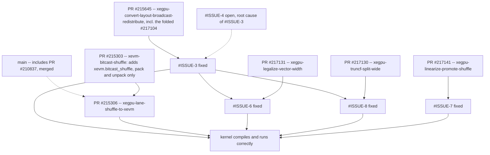

# Issue drafts: `simple_mxfp_gemm_quantizeA_F4.mlir` lowering

Eight drafts, ready to file. Cross-references are written as `#ISSUE-N` placeholders — replace
them with real issue numbers after filing (file `1` last so it can link to the rest, or file it
first and edit).

| file | title | status |
|---|---|---|
| `1-tracking-quantizeA_F4-lowering.md` | Tracking: test does not lower through `gpu-lower-to-xevm-pipeline` | resolved |
| `2-sgtolane-swallows-failure.md` | `XeGPUSgToLaneDistribute` silently ignores `applyPartialConversion` failure | open |
| `3-no-lowering-replicated-to-sliced-convert.md` | sg-to-lane: no lowering for replicated → partially-replicated `convert_layout` | fixed |
| `4-multireduction-lanes-on-reduced-dim.md` | `multi_reduction` layout rule places lanes on the reduced dim | open (root cause of 3) |
| `5-noop-convert-layout-from-conflict-resolution.md` | conflict resolution uses `isEqualTo`, emits 1040 no-op converts | open |
| `6-no-vector-width-legalization.md` | no vector width legalization before `convert-xegpu-to-xevm` | fixed |
| `7-mixed-size-shuffle-scalarization.md` | mixed-size `vector.shuffle` scalarized; 70% of emitted LLVM IR | fixed |
| `8-truncf-wider-than-one-conversion-group.md` | `arith.truncf` wider than one `xevm.truncf` group is not lowered | fixed |
| `9-array-length-narrowing-subgroup-size-only.md` | array-length narrowing only targets the subgroup size, so `lane_data > 1` descriptors keep their wide FCD | open |
| `10-wg-tests-stale-strict-properties.md` | WG integration tests do not parse since layout attributes became strict properties | open |

Attached repros (all verified against the built `mlir-opt`):

* `repro4.mlir` — self-contained single-subgroup version of the quantize-A chain; reproduces the
  exact layouts the full kernel produces. Inlined in draft 4.
* `repro5.mlir` — two minimal conflict-resolution cases. Inlined in draft 5.
* `repro6.mlir` — distilled family-B arithmetic chain; validates the unroll mechanism with the
  stock `--test-spirv-vector-unrolling`. Inlined in draft 6.
* `repro7.mlir` — three mixed-size `vector.shuffle` signatures; before/after with
  `--test-vector-shuffle-lowering`. Inlined in draft 7.

Draft 3 contains its own inline repro.

## Status

With drafts 3, 6, 7 and 8 fixed, `simple_mxfp_gemm_quantizeA_F4.mlir` compiles end to end through
`gpu-lower-to-xevm-pipeline`: `mlir-opt` exits 0 with empty stderr and emits a `gpu.binary @kernel`
ELF object. Emitted LLVM IR went from 68613 to 25380 lines.

**It also runs correctly.** The test XPASSes, reporting 0 mismatching elements out of 65536
against the reference. Sibling XeGPU integration tests were run on the same branch with no
regressions, though only `quantizeA_F4` and `dequantizeB_F4` had their numerical output confirmed
directly; the rest are verdict-only, because these tests' `// CHECK: 0` is a substring match that
runtime diagnostics can satisfy on their own. Details and the per-test breakdown are in draft 1
under "Validation".

`XFAIL: *` is kept on the test regardless, because executing it requires hardware that ordinary CI
does not have.

Drafts 2, 4 and 5 remain open. None blocks compilation; they are diagnostics, codegen-quality and
compile-time issues respectively.

## Branches

All on <https://github.com/silee2/llvm-project>.

| branch | base | upstream PR | contents | fixes |
|---|---|---|---|---|
| `xevm-bitcast-shuffle` | `main` | [#215303](https://github.com/llvm/llvm-project/pull/215303) | adds the `xevm.bitcast_shuffle` op + LLVM lowering; pack and unpack only | — |
| `xegpu-lane-shuffle-to-xevm` | `xevm-bitcast-shuffle` | [#215306](https://github.com/llvm/llvm-project/pull/215306) | `xegpu.lane_shuffle` → `xevm.bitcast_shuffle` | — |
| `xegpu-convert-layout-broadcast-redistribute` | `main` | [#215645](https://github.com/llvm/llvm-project/pull/215645) | distributes `convert_layout` redistributing broadcast data, including the non-equal-divisor case folded in from #217104 | #ISSUE-3 |
| `xegpu-convert-layout-broadcast-divisor` | — | ~~[#217104](https://github.com/llvm/llvm-project/pull/217104)~~ | folded into #215645; PR closed, branch retired | — |
| `xegpu-array-length-lane-data` | `main` | — | widened the FCD narrowing granularity to `lane_layout * lane_data`; superseded upstream, see #ISSUE-9 | — |
| `xegpu-truncf-split-wide` | `main` | [#217130](https://github.com/llvm/llvm-project/pull/217130) | `TruncfToXeVMPattern` accepts multiples of 16 | #ISSUE-8 |
| `xegpu-legalize-vector-width` | `main` | [#217131](https://github.com/llvm/llvm-project/pull/217131) | new `xegpu-legalize-vector-width` pass | #ISSUE-6 |
| `xegpu-linearize-promote-shuffle` | `main` | [#217141](https://github.com/llvm/llvm-project/pull/217141) | run the existing shuffle-promotion patterns in `xegpu-vector-linearize` | #ISSUE-7 |
| `xegpu-mxfp-combined` | `main` | — | integration branch: all of the above merged `--no-ff` | — |
| `xegpu-issue-drafts` | orphan | — | these drafts | — |

Already in `main`: the `xegpu.lane_shuffle` op, the `xevm.extf` op, the
`computeStaticDistributedCoords` layout interface method, and -- since
[PR #210837](https://github.com/llvm/llvm-project/pull/210837) was merged as `1200fe6f6cec` -- the
lowering of a `lane_data` repack `convert_layout` to `xegpu.lane_shuffle`. The former `pr-210837`
branch is therefore no longer carried.

`xevm.bitcast_shuffle` is **not** in `main` -- it is PR #215303, still open, which is why
`xegpu-lane-shuffle-to-xevm` is stacked on it rather than on `main`.

## Dependencies between the fixes

Solid arrows are branch stacking: the child is committed on top of the parent and cannot land
first. Dashed arrows are logical dependencies between changes that do not sit on the same branch.

* **PR #210837 is merged** (upstream commit `1200fe6f6cec`), so the `lane_data` repack
  `convert_layout` is lowered to `xegpu.lane_shuffle` in `main`. It is what produces the
  `xegpu.lane_shuffle` ops in this kernel, and **PR #215306** is what lowers them onto XeVM, hence
  the dashed arrow from `main`. It is no longer a separate branch to carry.
* **PR #215303** adds the `xevm.bitcast_shuffle` op. Following review it supports only two forms: a
  *pack*, taking a 1D vector and returning a scalar, and an *unpack*, its inverse. A vector to
  vector repack and a plain scalar to scalar bitcast are both rejected. This matches how
  `xegpu.lane_shuffle` is lowered onto it, which already used only the scalar forms. One consequence
  is that the packed side is a single value of one of the supported scalar types, which bounds the
  vector side at 64 bits in total. **PR #215306** is committed directly on top of #215303, so that
  has to land first.
* **PR #215645** also carries what was **PR #217104**: the generalization to non-equal divisors,
  deriving the extract index as `stride * ((slot / slotStride) % extent) + offset` so that target
  layouts whose distributed dimension is not the fastest varying one are covered too. #217104 has
  been folded into #215645 and closed, so there is one PR here rather than a stack of two.
* #ISSUE-4 is the *root cause* of #ISSUE-3: fixing it removes the need for the conversion that
  #ISSUE-3 adds a lowering for. The two are complementary, not exclusive, which is why the arrow is
  dashed rather than a prerequisite.
* #ISSUE-6 is only reachable once the XeGPU layer lowers cleanly, i.e. after #ISSUE-3.
* #ISSUE-8 is the other problem only reachable after #ISSUE-3, and it is fixed by
  `xegpu-truncf-split-wide`. That branch is required both before and after the #ISSUE-6 fix, because
  the sub-byte exemption in that fix deliberately leaves `arith.truncf ... to vector<32xf4E2M1FN>`
  32 components wide, so the two are complementary rather than alternatives.
* #ISSUE-7 is fully independent and can land on its own.
* #ISSUE-2 and #ISSUE-5 are independent of everything above.

Every change is now upstream as a PR. **#210837, #215303 and #215306 are merged**; #215645 (which
now includes the folded #217104), #217130, #217131 and #217141 are open. Drafts 9 and 10 have no PR
yet.

## Measurement environment

* `main` at `6523442d2efe` (which includes PR #210837), plus the branches listed above
  (branch `xegpu-mxfp-combined`).
* `mlir-opt`, Release + `BUILD_SHARED_LIBS=ON`.
* `mlir/test/Dialect/XeGPU`, `mlir/test/Dialect/Vector`, `mlir/test/Conversion/XeGPUToXeVM`,
  `mlir/test/Conversion/XeVMToLLVM`, `mlir/test/Conversion/VectorToLLVM`, `mlir/test/Dialect/GPU`,
  `mlir/test/Dialect/Arith`: 227/227 pass on the combined branch.
